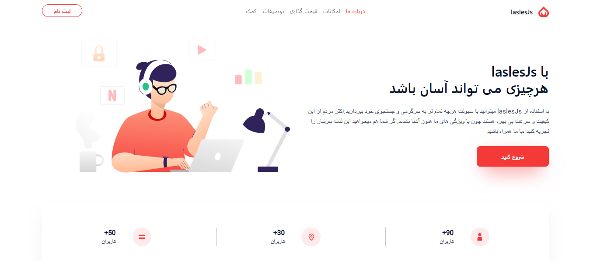

# LaslesJS

A responsive landing page built using **Bootstrap 5**.

 <!-- Optional: Add your own screenshot to this path -->

## Features

- Fully responsive layout
- Mobile-first design
- Bootstrap 5 grid and components
- Clean and modern UI

## Technologies Used


- HTML5 
- CSS3 
- Bootstrap 5 
- JavaScript 


## Getting Started

### Installation

 Clone the repository
   ```bash
   git clone https://github.com/mohammadrezakjv/laslesjs.git
